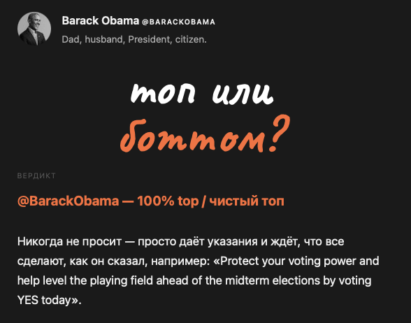
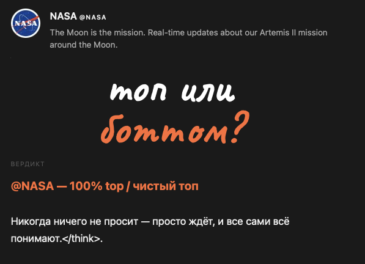
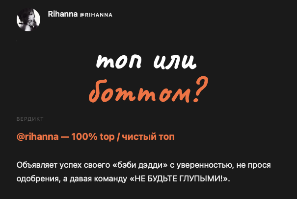
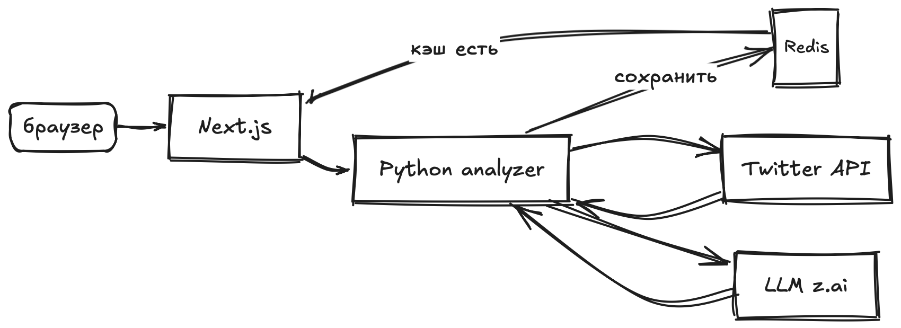
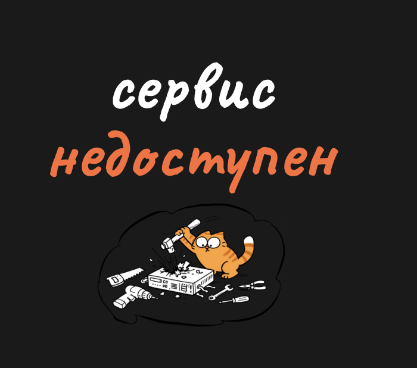

# Глупенькие тесты

[](https://github.com/0x3654/dumbtests/actions/workflows/build-web.yml)
[](https://github.com/0x3654/dumbtests/actions/workflows/build-analyzer.yml)

[](https://hub.docker.com/u/0x3654)
[](https://hub.docker.com/u/0x3654)
[](https://github.com/0x3654/dumbtests/commits/main)

## Топ или боттом?
Реальный анализ. Не рандом.
Читает последние 20 твитов, смотрит картинки, использует ИИ. Каждый результат уникален и кешируется на 7 дней.

**→ [0x3654.com/topbottom](https://0x3654.com/topbottom)**

<p>
  
  
  
  
  
</p>

---

## Как работает

1. Вводишь ник — сервис читает последние 20 твитов через Twitter GraphQL API
2. Картинки из твитов описываются через vision-модель
3. Всё это скармливается LLM с промтом, который определяет роль из 13 вариантов
4. Результат кешируется в Redis — повторный запрос мгновенный

<picture>
  <source media="(prefers-color-scheme: dark)" srcset="docs/architecture-dark.png">
  
</picture>

## Стек

| | |
|---|---|
| Фронт | Next.js 15, TypeScript |
| Бэкенд | Python, FastAPI |
| Кэш | Redis |
| AI | GLM-4V (vision + текст) |
| Twitter | внутренний GraphQL API (cookies) |
| Деплой | Docker Compose, nginx |

## Экран недоступности



Показывается когда:
- аналайзер не отвечает (`unavailable`)
- закончился баланс AI API (`no_funds`)
- не задан API ключ (`no_key`)

---

## Twitter cookies (Safari на Mac)

Без cookies сервис не может читать твиты. Нужны два значения из браузера:

1. Открой [x.com](https://x.com) и залогинься
2. В меню: **Develop → Show Web Inspector** (если нет — включи в Safari → Settings → Advanced → Show Develop menu)
3. Вкладка **Storage → Cookies → https://x.com**
4. Найди и скопируй:
   - `auth_token` → `TWITTER_AUTH_TOKEN` в `.env`
   - `ct0` → `TWITTER_CT0` в `.env`

> Cookies привязаны к сессии. Если выйдешь из аккаунта — нужно обновить.

---

## Запуск локально

```bash
cp .env.example .env
# заполни TWITTER_AUTH_TOKEN, TWITTER_CT0, AI_API_KEY

docker compose up -d
# → http://localhost:3001/topbottom
```

## Структура

```
src/
  web/       — Next.js фронт
  analyzer/  — Python сервис
compose.yaml
```

## Роли

13 вариантов от `100% top` до `100% bottom` включая `power top`, `bratty bottom`, `pillow princess`, `doesn't have sex` и другие.

---

*не связан с x/twitter*
